# UCANlog Append Flow - Sequence Diagram
> This diagram illustrates the complete flow of appending data to a transparency log, from client invocation through witness validation to storage in Storacha.

## Architecture Overview

The system uses a distributed UCAN delegation model where:
- **Space DID** identifies both the log and the Storacha storage location
- **Agent** acts on behalf of the space owner
- **UCANlog service** with delegated permission writes to the customer's space
- **Witness service** (litewitness) cryptographically verifies checkpoints
- **Tessera** manages the transparent log Merkle tree structure

```mermaid
sequenceDiagram
    participant Client as Client (Browser/App)
    participant Agent as Agent Signer
    participant UCANlog as UCANlog Service
    participant Tessera as Tessera Library
    participant Witness as Witness Service<br/>(litewitness)
    participant Storacha as Storacha Network
    participant Space as Customer Space

    Note over Client,Space: Pre-existing Setup
    Note over Space,Agent: Space → Agent delegation<br/>(created via `storacha delegation create`)
    Note right of Agent: Delegation grants:<br/>- space/blob/add<br/>- space/index/add<br/>- upload/add
    
    Note right of Client: SpaceDID = LogID<br/>(e.g., did:key:z6Mk...)

    %% Client prepares request
    Client->>Agent: Parse agent secret
    Note right of Agent: Agent = did:key:...
    
    Client->>Client: Parse Space → Agent delegation
    Note right of Client: Delegation[Space→Agent]
    
    Client->>Client: Create service delegation
    Note right of Client: Delegation[Agent→UCANlog]<br/>Audience: UCANlog service DID<br/>Resource: Space DID<br/>Proofs: [Space→Agent delegation]
    Note right of Client: Contains Storacha capabilities
    
    Client->>Client: Serialize delegation to base64
    
    %% Client makes append request
    Client->>UCANlog: POST /rpc (UCAN RPC)
    Note right of Client: {
    Note right of Client:   capability: {
    Note right of Client:     can: "tlog/append",
    Note right of Client:     with: SpaceDID,
    Note right of Client:     nb: {
    Note right of Client:       data: base64(data),
    Note right of Client:       delegation: base64(Delegate[Agent→UCANlog])
    Note right of Client:     }
    Note right of Client:   },
    Note right of Client:   issuer: Agent DID,
    Note right of Client:   audience: UCANlog service DID
    Note right of Client: }
    
    %% UCANlog validates
    UCANlog->>UCANlog: Extract delegation from invocation
    
    UCANlog->>UCANlog: Verify delegation chain:
    Note right of UCANlog: 1. Space → Agent ✓<br/>(matches invocation.issuer)<br/>2. Agent → UCANlog ✓<br/>(service is audience)<br/>3. Capabilities allow<br/>   space/blob/add<br/>4. Resources match SpaceDID
    
    UCANlog->>UCANlog: Verify: invocation.issuer == Delegate[Agent→UCANlog].issuer
    Note right of UCANlog: Prevents delegation theft
    
    UCANlog->>UCANlog: Check revocation cache
    Note right of UCANlog: Ensure delegation not revoked
    
    %% UCANlog gets or creates log
    UCANlog->>UCANlog: Get LogInstance for SpaceDID
    alt Log doesn't exist
        Note right of UCANlog: LogInstance includes:<br/>- Tessera Appender<br/>- Tessera Reader<br/>- Tessera Driver<br/>- Customer SpaceDID
        UCANlog->>UCANlog: Create log storage path:<br/>./data/logs/{spaceDID}
        UCANlog->>UCANlog: Load witness_policy.txt
        Note right of UCANlog: Configures N-out-of-M witness requirements
    end
    
    %% Tessera appends entry
    UCANlog->>Tessera: appender.Add(ctx, data)
    Note right of Tessera: Batching & queueing
    
    alt Batch ready (size or time)
        Tessera->>Tessera: Create sequence bundle
        Note right of Tessera: Bundle multiple entries<br/>with Merkle tree structure
        
        Tessera->>Tessera: Calculate new checkpoint
        Note right of Tessera: Checkpoint = hash(tree_root, size, timestamp)
        
        Tessera->>Witness: Request witness signature
        Note right of Witness: Witness verifies:<br/>- Origin: ucanlog/logs/[SpaceDID]<br/>- Checkpoint validity<br/>- Chain consistency
        Witness-->>Tessera: Witness signature
        
        Tessera->>Tessera: Compile CAR file
        Note right of Tessera: CAR includes:<br/>- Bundle data<br/>- Checkpoint<br/>- Witness signatures<br/>- Index entries
    end
    
    %% Store in Storacha
    Note over UCANlog,Space: Now UCANlog must store using<br/>customer's delegation
    
    Tessera->>UCANlog: flushFn(ctx, items)
    
    UCANlog->>UCANlog: Extract Storacha capabilities<br/>from delegation caveats
    Note right of UCANlog: Capabilities:<br/>- space/blob/add<br/>- space/index/add<br/>- upload/add
    
    UCANlog->>Storacha: POST /blob/add
    Note right of UCANlog: Uses Agent DID with<br/>Space→Agent delegation in caveats
    Note right of UCANlog: Authorization: AgentDID<br/>Resource: SpaceDID
    Storacha-->>UCANlog: blobCID
    
    Tessera->>UCANlog: Index to persist
    
    UCANlog->>Storacha: POST /index/add
    Note right of UCANlog: Index CAR references blobCID<br/>Contains Merkle path data
    Storacha-->>UCANlog: indexCID
    
    UCANlog->>Storacha: POST /upload/add
    Note right of UCANlog: Registers the upload:<br/>- Root = indexCID<br/>- Shards = blob chunks<br/>- Origin = ucanlog/logs/[SpaceDID]
    Storacha-->>UCANlog: uploadCID
    
    %% Verify storage
    UCANlog->>Space: Confirm CIDs in Space
    Note right of Space: SpaceDID = owner of storage
    Note right of Space: Contains CAR files at:<br/>- blobCID<br/>- indexCID<br/>- upload metadata
    
    UCANlog->>UCANlog: Update local coordinator<br/>with new checkpoint
    
    UCANlog->>UCANlog: Persist index CAR CID mapping
    Note right of UCANlog: Maps logical entry index<br/>to Storacha CIDs for reads
    
    %% Response to client
    UCANlog-->>Client: { index: N, checkpoint: CID }
    Note right of UCANlog: Returns the logical<br/>index position
    
    %% Read path (for completeness)
    Note over Client,Space: Read Flow
    
    Client->>UCANlog: read({ offset, limit })
    UCANlog->>UCANlog: Get index mappings
    UCANlog->>Space: Fetch CARs by CID
    Space-->>UCANlog: CAR data
    UCANlog->>UCANlog: Reconstruct entries from CARs
    UCANlog-->>Client: { entries: [...], total: M }
    
    %% Note on security properties
    Note over UCANlog,Space: Security Properties
    Note over UCANlog,Space: ✓ Authorization: Space→Agent→UCANlog<br/>✓ Witness verification: Signed checkpoints<br/>✓ Immutable log: Appended data cannot be modified<br/>✓ Customer-controlled: Data in customer's Space<br/>✓ Stateless: No server-side sessions
```

## Key Components Explained

### 1. UCAN Delegations
- **Delegation[Space→Agent]**: Created by space owner, grants storage capabilities to an agent
- **Delegation[Agent→UCANlog]**: Created by client for each request, grants UCANlog service temporary access to write to the space
- **Invocation**: Signed by Agent, contains delegation in caveats, prevents delegation theft

### 2. Tessera Integration
- Manages append-only Merkle tree structure
- Batches entries for efficiency
- Coordinates witness signatures on checkpoints
- Creates CAR (Content-Addressable Archive) files for immutable storage

### 3. Witness Service (Litewitness)
- Cryptographically verifies log checkpoints
- Prevents split-view attacks
- Ensures global consistency across distributed logs
- Configured with origin-based verifier keys

### 4. Storacha Storage
- Customer's own Storacha space identified by SpaceDID
- UCANlog service performs operations on behalf of customer using delegated capabilities
- Data stored as CAR files containing log bundles and index structures
- Customer retains full ownership and control of their data

### 5. Stateless Authentication
Every request is independently authenticated:
- Delegation chain validation
- Revocation check
- Invocation authorization verification
- No server-side session state required
