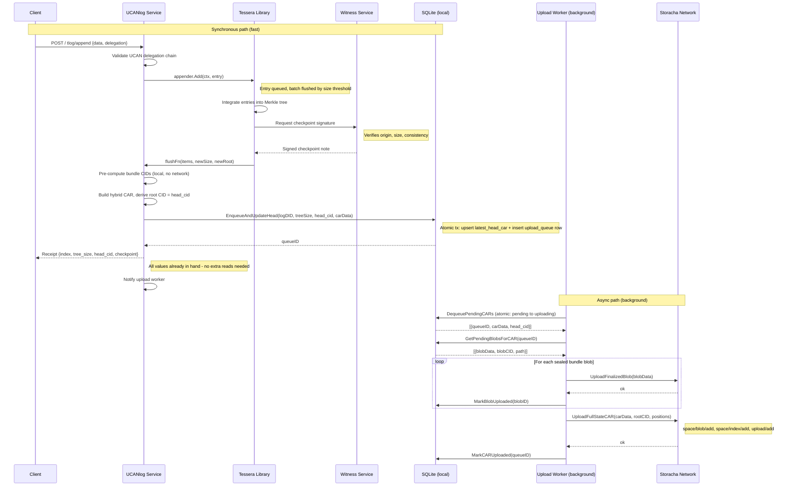
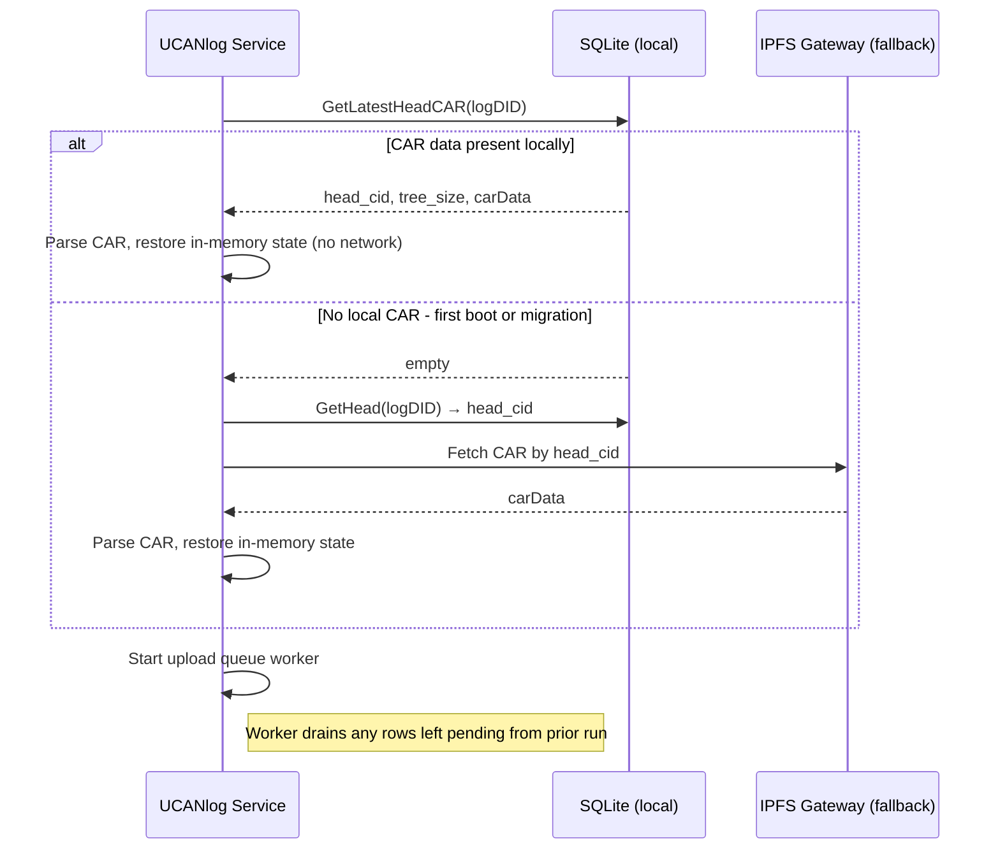

# UCANlog Append Flow — Sequence Diagram

> Illustrates the complete flow from client invocation through Tessera sequencing,
> checkpoint signing, synchronous receipt, and async Storacha upload.

## Design Principles

- **Synchronous path is fast**: entry is sequenced, Merkle tree updated, checkpoint signed, and a receipt returned — all before any network I/O to Storacha.
- **Async upload**: the head CAR (full in-memory tlog state) is written to a local SQLite queue and uploaded to Storacha by a background worker.
- **Pre-computed CID**: the CAR's root CID is computed locally (content-addressed) before upload, so the receipt can include it immediately.
- **Cold-start recovery**: on restart, state is restored from the latest locally-stored CAR rather than fetching from the network.

---

## Append Flow

```mermaid
sequenceDiagram
    participant Client
    participant UCANlog as UCANlog Service
    participant Tessera as Tessera Library
    participant Witness as Witness Service
    participant SQLite as SQLite (local)
    participant Worker as Upload Worker (background)
    participant Storacha as Storacha Network

    Note over Client,SQLite: Synchronous path (fast)

    Client->>UCANlog: POST / tlog/append {data, delegation}
    UCANlog->>UCANlog: Validate UCAN delegation chain
    UCANlog->>Tessera: appender.Add(ctx, entry)
    Note right of Tessera: Entry queued, batch flushed by size threshold

    Tessera->>Tessera: Integrate entries into Merkle tree
    Tessera->>Witness: Request checkpoint signature
    Note right of Witness: Verifies origin, size, consistency
    Witness-->>Tessera: Signed checkpoint note

    Tessera->>UCANlog: flushFn(items, newSize, newRoot)
    UCANlog->>UCANlog: Pre-compute bundle CIDs (local, no network)
    UCANlog->>UCANlog: Build hybrid CAR, derive root CID = head_cid

    UCANlog->>SQLite: EnqueueAndUpdateHead(logDID, treeSize, head_cid, carData)
    Note right of SQLite: Atomic tx: upsert latest_head_car + insert upload_queue row
    SQLite-->>UCANlog: queueID

    UCANlog-->>Client: Receipt {index, tree_size, head_cid, checkpoint}
    Note right of UCANlog: All values already in hand - no extra reads needed

    UCANlog->>UCANlog: Notify upload worker

    Note over Worker,Storacha: Async path (background)

    Worker->>SQLite: DequeuePendingCARs (atomic: pending to uploading)
    SQLite-->>Worker: [{queueID, carData, head_cid}]
    Worker->>SQLite: GetPendingBlobsForCAR(queueID)
    SQLite-->>Worker: [{blobData, blobCID, path}]

    loop For each sealed bundle blob
        Worker->>Storacha: UploadFinalizedBlob(blobData)
        Storacha-->>Worker: ok
        Worker->>SQLite: MarkBlobUploaded(blobID)
    end

    Worker->>Storacha: UploadFullStateCAR(carData, rootCID, positions)
    Note right of Storacha: space/blob/add, space/index/add, upload/add
    Storacha-->>Worker: ok
    Worker->>SQLite: MarkCARUploaded(queueID)
```

---

## Cold-Start Recovery

```mermaid
sequenceDiagram
    participant UCANlog as UCANlog Service
    participant SQLite as SQLite (local)
    participant Gateway as IPFS Gateway (fallback)

    UCANlog->>SQLite: GetLatestHeadCAR(logDID)
    alt CAR data present locally
        SQLite-->>UCANlog: head_cid, tree_size, carData
        UCANlog->>UCANlog: Parse CAR, restore in-memory state (no network)
    else No local CAR - first boot or migration
        SQLite-->>UCANlog: empty
        UCANlog->>SQLite: GetHead(logDID) → head_cid
        UCANlog->>Gateway: Fetch CAR by head_cid
        Gateway-->>UCANlog: carData
        UCANlog->>UCANlog: Parse CAR, restore in-memory state
    end

    UCANlog->>UCANlog: Start upload queue worker
    Note right of UCANlog: Worker drains any rows left pending from prior run
```

---
